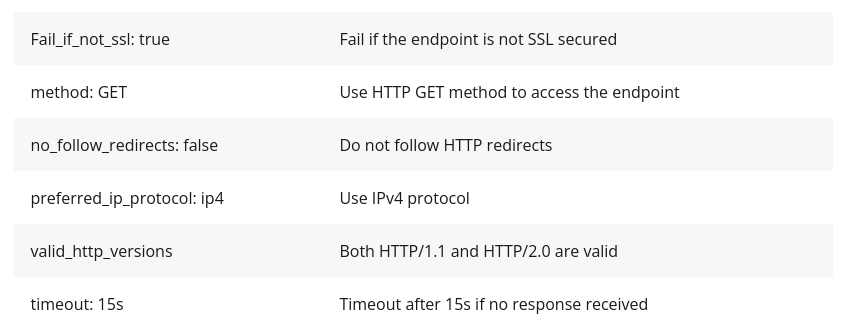

## Blackbox/VictoriaLogs
Probing of endpoints over HTTP, HTTPS, DNS, TCP, and ICMP

To use VictoriaLogs with Blackbox Exporter probes (such as HTTP probes) outside Kubernetes, the typical flow is:
  - Blackbox Exporter runs probes on targets and exports Prometheus-format metrics.
  - VMAgent scrapes these Blackbox Exporter probe metrics via its HTTP /probe endpoint.
  - VictoriaLogs collects logs from VMAgent or Blackbox Exporter for rich querying.

- https://github.com/prometheus/blackbox_exporter
- https://medium.com/trendyol-tech/probing-endpoints-with-blackbox-exporter-how-why-4417fce0993a
- https://www.opsramp.com/guides/prometheus-monitoring/prometheus-blackbox-exporter/
     
    

#### HTTP Module
```yaml
modules: 
  http_2xx: 
    http: 
      fail_if_not_ssl: true
      ip_protocol_fallback: false
      method: GET
      no_follow_redirects: false
      preferred_ip_protocol: ip4
      valid_http_versions: 
        - HTTP/1.1
        - HTTP/2.0
    prober: http
    timeout: 15s
```  
#### Defintion of Module



####  TCP Module
```yaml
modules: 
  tcp_connect: 
    prober: tcp
    tcp: 
      ip_protocol_fallback: false
      preferred_ip_protocol: ip4
      tls: true
      tls_config: 
        insecure_skip_verify: true
        server_name: myserver
    timeout: 15s
```

**NOTE:** Above config requires Prometheus scrape config to get the relevant metrics from the blackbox endpoint. 
